# NTRO Social Intelligence Platform - System Architecture

## 1. High-Level Architecture Overview

The **NTRO AI-Powered Social Media Intelligence & Network Analysis Platform** is an enterprise-grade full-stack intelligence system engineered for continuous data collection, timeline management, multi-dimensional sentiment polarity inference, privacy-preserving aggregate demographic profiling, real-time trend velocity forecasting, and network link topology analysis.

```mermaid
graph TD
    subgraph "External Ingestion Adapters"
        X[X / Twitter v2]
        TG[Telegram MTProto]
        RD[Reddit OAuth]
        YT[YouTube Data API]
        MOCK[Synthetic Demo Generator]
    end

    subgraph "Ingestion Worker (@ntro/ingestion)"
        NORM[Data Normalizer & Deduplicator]
        STREAM[Real-Time Event Stream]
    end

    subgraph "Core Backend Services (@ntro/api)"
        AUTH[JWT & RBAC Security]
        REST[REST API Endpoints]
        EVENT_BUS[WebSocket Gateway]
        SIM[SIH Demo Event Engine]
    end

    subgraph "AI & NLP Pipeline (services/ai-service)"
        FASTAPI[FastAPI Service]
        SENTIMENT[Multi-Lingual Sentiment Polarity]
        EMOTION[10-Emotion Taxonomy]
        STANCE[Stance & Sarcasm Inference]
        TOPICS[Semantic Topic Extraction]
        GRAPH_AI[Centrality & PageRank Engine]
    end

    subgraph "Storage Layer"
        PG[(PostgreSQL + TimescaleDB)]
        REDIS[(Redis Cache)]
        NEO4J[(Neo4j Graph DB)]
    end

    subgraph "Analyst Frontend (@ntro/web)"
        DASH[Next.js 14 Dashboard]
        NET_UI[SVG Topology Visualizer]
        CHRONO[Chronological Timeline]
        AI_CHAT[Grounded AI Analyst QA]
        ALERT_UI[Threat & Anomaly Center]
        REP_UI[PDF/CSV/JSON Report Generator]
    end

    X --> NORM
    TG --> NORM
    RD --> NORM
    YT --> NORM
    MOCK --> NORM

    NORM --> REST
    NORM --> EVENT_BUS

    REST --> PG
    REST --> REDIS
    REST --> NEO4J
    REST <--> FASTAPI

    EVENT_BUS --> DASH
    REST --> DASH
```

## 2. Five Integrated Intelligence Pillars

1. **Continuous Data Collection & Timeline Management**:
   - Stream ingestion worker normalizes diverse platforms into a unified TypeScript model (`Post`).
   - Reconstructs chronological narratives (`POST → INTERACTION → SENTIMENT → TOPIC → INFLUENCE → PROPAGATION`).

2. **Multi-Dimensional Sentiment & Emotion Inference**:
   - Polarity (-1.0 to +1.0).
   - 10-Emotion Taxonomy (Joy, Anger, Fear, Sadness, Surprise, Excitement, Anxiety, Supportive, Hostile, Neutral).
   - Ideological Stance (Support, Against, Neutral).
   - Sarcasm probability & confidence intervals.

3. **Aggregate Privacy-Preserving Demographic Profiling**:
   - Aggregate statistical models across Age Brackets, Geographic Regions of India, Discourse Languages, and Professional Interests.
   - Zero sensitive individual attribute inference.

4. **Real-Time Trend & Semantic Narrative Detection**:
   - Velocity tracking (mentions/hr & engagement velocity).
   - State classification: `EMERGING`, `GROWING`, `VIRAL`, `STABLE`, `DECLINING`.
   - Time-series evolution forecasting.

5. **Link Analysis & Network Topology**:
   - Entity graph representation with nodes (Users, Topics, Communities) and edges (Replies, Mentions, Reposts, Shares).
   - Algorithmic centrality computation: PageRank, Betweenness Centrality, Degree Centrality, and Louvain Modularity Community Partitioning.

## 3. Grounded AI Analyst QA

- Natural language question-answering grounded strictly in collected database facts.
- Automatic generation of structured evidence cards and confidence metrics.

